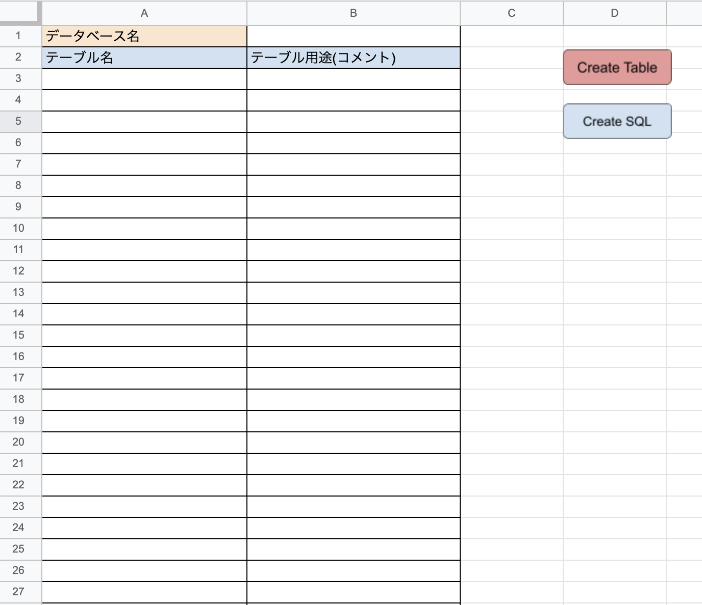
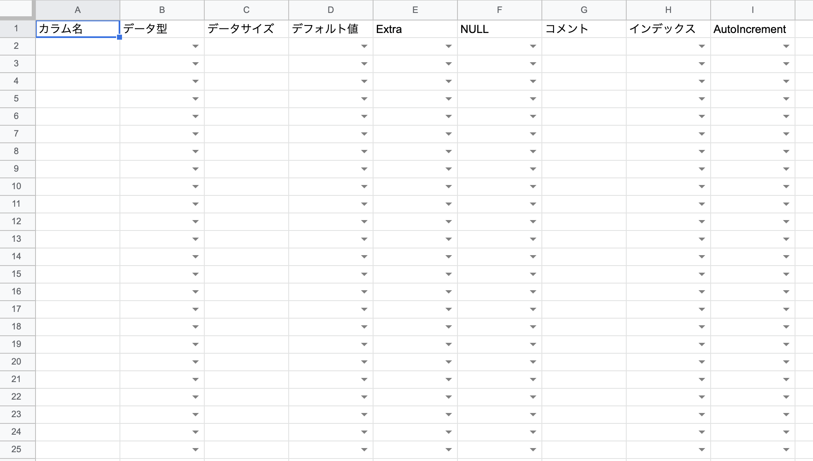

# システム
Googleスプレッドシートに記述されたテーブル構造を元にSQLを自動生成します。  
テーブル設計と同時にSQLまで生成できるシステムなので利便性と効率が上がります。
# 技術仕様
・ Google Apps Script

# 使い方
1. DBInfoというシートを作成
  
  CreateTable => CreateTableのスクリプトが実行されるボタンを配置  
  CreateSQL => CreateSqlのスクリプトが実行されるボタンを配置  
  ※ セルの場所指定になっているのでシートの構造は変更できません。

2. DBInfoのデータベース名を入力
3. テーブル名とテーブルコメントを入力
4. CreateTableを実行  
  ※ 実行すると記述されたテーブルのシートが作成されます。
5. 各テーブルシートに必要なレコードを記述します。
6. テーブルに必要なレコードを入力
  
7. CreteSQLを実行  
  全てのテーブルシートに必要なレコードを入力したらCreateSQLでSQLを生成します。
8. exportSQLに生成されたSQLが記述されます。  
  このシートは存在しない場合は生成される設定になっているので、再編集の際に邪魔な場合は削除しても大丈夫です。
